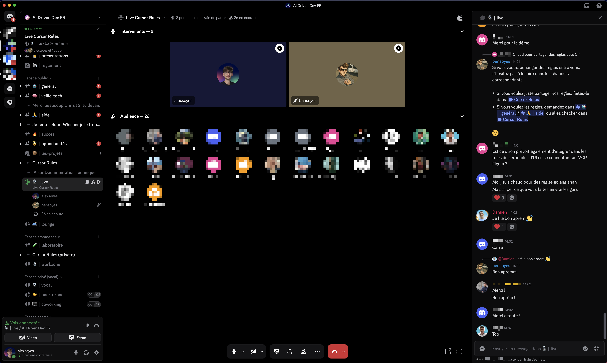

# CONTRIBUTION

Notre but est de se partager **LES MEILLEURES RÈGLES** pour mieux coder avec l'IA.

## Rejoindre la Core Team

**Ce dépôt sert à mettre en avant les membres contributeurs de l'AI-Driven Dev.**

| Niveau | Responsabilités | Accessibilité |
|--------|----------------|-------|
| 🌱 **Alpha** | Création et améliorations des règles, Contribution doc | ★★★ |
| 🧑‍💻 **Beta** | Coder l'extension VSCode | ★★☆ |
| 🚀 **Delta** | Prompt Engineering | ★☆☆ |

### Qui peut nous rejoindre ?

**Tous les devs, peu importe le niveau peuvent rejoindre l'aventure.**

La plus petite amélioration sera bénéfique à la communauté : si vous avez un compte GitHub, n'hésitez pas !

### Comment contribuer ?

1. **Participez aux lives** du vendredi midi.
2. Forker le dépôt [https://github.com/ai-driven-dev/rules](https://github.com/ai-driven-dev/rules)
3. Commitez vos changements
4. **Faire une pull-request** pour que l'on intègre vos changements.
5. Demander l'avis d'un reviewer @AIDrivenDev.
6. On merge ça vite pour que ça bénéficie à la communauté.

## Todo list

Voici la liste des fonctionnalités à venir, par Team.

### 🌱 Team Alpha

Responsable de la qualité du dépôt et des règles

- [ ] Amélioration de la documentation [README.md](README.md), [CONTRIBUTING.MD](./CONTRIBUTING.md)...
- [ ] Optimiser les règles existantes dans [./.cursor/rules](./.cursor/rules/)
- [ ] Créer une nouvelle règle à partager avec le [./.cursor/rules/meta-generator.mdc](./.cursor/rules/meta-generator.mdc)

### 🧑‍💻 Team Beta

Responsable du développement de l'extension VSCode "AI-Driven Dev Rules".

- [ ] Standards de contribution pour l'extension + règles de [./vscode/ai-driven-dev-rules/README.md](./vscode/ai-driven-dev-rules/README.md).
- [ ] Configurer `Biome` avec `lefthook`.
- [ ] Possibilité de mettre à jour une règle existante par son nom

#### Kickstart routine IA

- [ ] Règles de base indépendantes dans un dossier `base-rules` → copiées dans .cursor/rules, .clinerules, .github/prompts, etc.
- [ ] Agents indépendants dans un dossier base que l'on peut utiliser dans `Roo`
- [ ] Idée : Liste de MCPs à partager

### 🚀 Team Delta

Responsable d'améliorer le mécanisme de génération, d'ajouter de nouvelles features.

- [ ] Améliorer le système de mémoire standardisé → Mémoire, PRDs, Tâches, ADR, LLM.txt, documents téléchargés
- [ ] Compression syntaxique sur le [./.cursor/rules/meta-generator.mdc](./.cursor/rules/meta-generator.mdc)
- [ ] Définir les standards Agentics (`modes.json`) quand Cursor sera prêt
