# AI-Driven Dev Rules


[](https://discord.gg/invite/ai-driven-dev)

Partagez vos règles IA personnalisées avec la communauté.

Envie de faire avec nous ?
[>>> 🔥 REJOINDRE LA CORE TEAM <<<](./CONTRIBUTING.md)

[](https://www.youtube.com/watch?v=DFTc0W3oTyQ)

## Table des matières

- [Table des matières](#table-des-matières)
- [🧠 4 minutes pour commencer](#-4-minutes-pour-commencer)
- [👨‍💻 Comment installer les règles AIDD ?](#-comment-installer-les-règles-aidd-)
  - [Télécharger l'extension "AI-Driven Dev Rules"](#télécharger-lextension-ai-driven-dev-rules)
  - [Utiliser l'extension](#utiliser-lextension)
- [🚀 Bien démarrer](#-bien-démarrer)
  - [Comment coder avec des règles ?](#comment-coder-avec-des-règles-)
- [✅ Ajouter vos règles](#-ajouter-vos-règles)
  - [1. Structure de nommage (à plat)](#1-structure-de-nommage-à-plat)
  - [2. Organisation des dossiers](#2-organisation-des-dossiers)
  - [3. Générations et Mises à jour](#3-générations-et-mises-à-jour)
  - [4. Exemple d'une bonne règle](#4-exemple-dune-bonne-règle)
  - [Bonus : Démo](#bonus--démo)
- [🇫🇷 Contributions disponibles](#-contributions-disponibles)

## 🧠 4 minutes pour commencer

Avantages :

- **Apprendre à générer** des règles IA
- **Créer des règles optimisées** pour Cursor (partagées et validées par la communauté)
- **Standard de contribution** pour tous les contributeurs
- **Ultra simple** et rapide à setup

Workflow :

```mermaid
flowchart LR
    classDef titleClass fill:none,stroke:none,color:#333333,font-size:16px,font-weight:bold
    title[Extension VS Code pour récupération des règles depuis GitHub]
    class title titleClass

    A[Extension VS Code] -->|1| B[Connexion GitHub<br>+ Token optionnel]
    B -->|2| C[Récupération de la<br>structure du dépôt]
    C -->|3| D[Sélection et téléchargement<br>des fichiers/règles]
    D -->|4| E[Utilisation des règles<br>dans l’IDE]

    style A fill:#4b89dc,stroke:#2e5daa,color:white,stroke-width:2px,border-radius:10px,font-weight:bold
    style B fill:#2ecc71,stroke:#27ae60,color:white,stroke-width:2px,border-radius:10px,font-weight:bold
    style C fill:#9b59b6,stroke:#8e44ad,color:white,stroke-width:2px,border-radius:10px,font-weight:bold
    style D fill:#f39c12,stroke:#e67e22,color:white,stroke-width:2px,border-radius:10px,font-weight:bold
    style E fill:#e74c3c,stroke:#c0392b,color:white,stroke-width:2px,border-radius:10px,font-weight:bold

    linkStyle 0,1,2,3 stroke-width:2px,stroke:#888888,color:black
```



## 👨‍💻 Comment installer les règles AIDD ?

### Télécharger l'extension "AI-Driven Dev Rules"

1. Télécharger la dernière version [ai-driven-dev-rules-0.0.3.vsix](https://github.com/ai-driven-dev/rules/blob/main/vscode/ai-driven-dev-rules/ai-driven-dev-rules-0.0.3.vsix)
2. Ouvrir Cursor
3. Dans la palette de commandes (`Ctrl + Shift + P`)
4. Taper `Extension: Install from VSIX`
5. Installer l'extension et cliquer sur le nouvelle icône GitHub !

Problèmes connus :

> L'API de GitHub est open mais vous pouvez vous faire Rate Limit.

1. Récupérer un Token sur GitHub [https://github.com/settings/tokens](https://github.com/settings/tokens).
2. AUCUN ROLE NÉCESSAIRE.
3. Dans VSCode, ouvrir les Réglages.
4. Rechercher: `Aidd: GitHub Token`.
5. **Rajouter votre Token pour éviter une réponse HTTP 429**

### Utiliser l'extension

1. Ouvrir l'extension "AI-Driven Dev Rules" via l'icône GitHub
2. Cliquer sur le bouton `Add Repository` (ou utilisez directement notre dépôt ⭐ Featured)
3. Télécharger le dossier `.cursor/rules`.

## 🚀 Bien démarrer

### Comment coder avec des règles ?

1. Ouvrir le mode Agent de votre IDE (comme Cursor).
2. Donner du contexte avec votre prompt: `use real users in @admin.tsx from @users.controller.ts`.
3. L'agent crée les règles correspondantes AVEC VOUS.

Bonus:

> Demander à l'agent s'il a bien respecté les règles.

```markdown
Vérifie l'application des règles.
```

## ✅ Ajouter vos règles

Contribuer aux règles AI-Driven Dev est TRÈS simple et direct.

### 1. Structure de nommage (à plat)

Stockage flat dans `.cursor/rules`.

Nom des règles :

```text
#-rule-name[@version][-specificity].mdc
```

- `#` : Numéro de la catégorie (voir ci-dessous)
- `-rule-name` : Nom de la règle
- `@version` : Version de la règle (_optionnel_)
- `-specificity` : Sous-partie spécifique (_optionnel_)
- `.mdc` : Extension pour Cursor

### 2. Organisation des dossiers

Les règles sont organisées par dossiers, chaque dossier représentant une catégorie.

| Numéro | Catégorie                     | Exemples                              |
| ------ | ----------------------------- | ------------------------------------- |
| `00`   | 🏛️ `architecture`             | Clean, Onion, 3-tiers...              |
| `01`   | 📏 `standards`                | Coding, Naming, formatting, structure |
| `02`   | 💻 `programming-languages`    | JavaScript, TypeScript, Python        |
| `03`   | 🛠️ `frameworks-and-libraries` | React, Vue, Angular, Next.js          |
| `04`   | ⚙️ `tools-and-configurations` | Git, ESLint, Webpack, Docker          |
| `05`   | 🔄 `workflows-and-processes`  | PR reviews, deployment, CI/CD         |
| `06`   | 📋 `templates-and-models`     | Project templates, PRDs, READMEs      |
| `07`   | ✅ `quality-assurance`        | Testing, security, performance        |
| `08`   | 🎯 `domain-specific-rules`    | À partager avec votre équipe          |
| `09`   | 🔍 `other`                    | Ne rentre dans aucune autre catégorie |

Exemples :

```text
./.cursor/rules/03-frameworks-and-libraries/
├── 3-react.mdc
├── 3-react@18.mdc
├── 3-react@19.mdc
├── 3-react@19-hook.mdc
└── 3-react@19.1-hook.mdc
```

### 3. Générations et Mises à jour

1. Ouvrir un chat **en mode Agent**.
2. Choisir le modèle `GPT 4.1`.
3. Ajouter la Cursor Rules `meta-generator.mdc`.
4. Promptez !

**Créer une nouvelle règle :**

```markdown
Generate cursor rules for: ...
```

**Créer une nouvelle règle (depuis un example) :**

```markdown
Based on example, generate cursor rules for: ...

<example>
...
</example>
```

**Mettre à jour une règle existante :**

```markdown
Update cursor rules with: ...

@3-react@18.mdc
```

### 4. Exemple d'une bonne règle

Les règles générées doivent être le plus court possible.

Exemple : [./.cursor/rules/01-standards/1-clean-code.mdc](./.cursor/rules/01-standards/1-clean-code.mdc)

### Bonus : Démo

Demain...Vendredi 18 avril 2025.

## 🇫🇷 Contributions disponibles

Vous pouvez contribuer à ce projet en :

- Partager ses règles
- Améliorer les règles existantes
- Maintenir l'extension VSCode

[>>> 🔥 REJOINDRE LA CORE TEAM <<<](./CONTRIBUTING.md)
